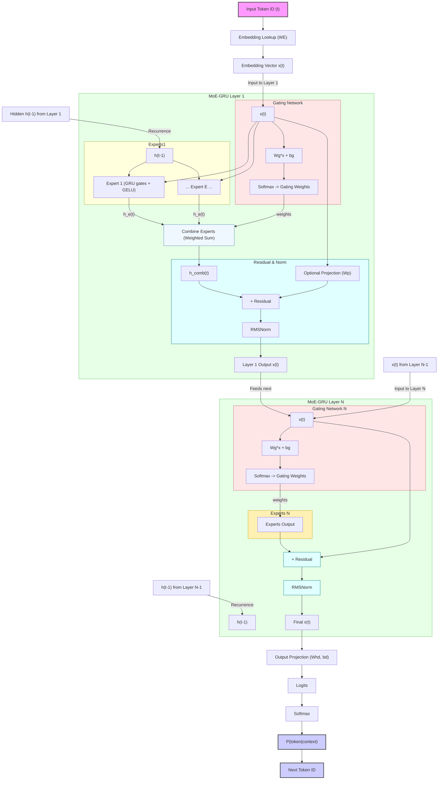

# Shoestring

This project implements a compact language model in Go, designed primarily for **next-token prediction** tasks, especially on **resource-constrained hardware**. It features a custom GRU architecture.

The model can be trained from text data and then used interactively via a command-line chat interface.

## Features

*   **BPE Tokenizer:** Uses Byte Pair Encoding for subword tokenization, trainable from a corpus. Special tokens (`[USER]`, `[BOT]`, `[EOS]`, `[PAD]`, `[UNK]`) are handled.
*   **Training:**
    *   Trains on plain text files.
    *   Uses AdamW optimizer with configurable hyperparameters (learning rate, weight decay, epsilon).
    *   Supports gradient clipping for training stability.
    *   Checkpointing system to save and resume training progress (includes model weights, optimizer state, BPE tokenizer state, and configuration).
*   **Inference:**
    *   Interactive command-line chat interface.
    *   Generates responses token by token based on the trained model.
    *   Configurable maximum response length.
*   **Cross-Platform:** Pre-compiled binaries are provided for common operating systems and architectures.

## Purpose

The main goal of this project is to provide a functional example of a modern, efficient language model architecture. 
It is specifically tailored for environments where computational resources (CPU, RAM) might be limited, making it potentially suitable for edge devices or low-power servers where large transformer models are infeasible. 
Its primary function is sequential prediction (predicting the next token given previous ones), which forms the basis for text generation.

## Getting Started (Using Pre-compiled Binaries)

1.  **Download:** Download the appropriate binary for your system from the releases section (or wherever you are distributing them).

    | OS      | Architecture | Target                | Binary Suffix (Example) |
    | :------ | :----------- | :-------------------- | :---------------------- |
    | Linux   | amd64        | 64-bit Linux          | `min-gru-linux-amd64`   |
    | Windows | amd64        | 64-bit Windows        | `min-gru-windows-amd64.exe` |
    | macOS   | amd64        | macOS (Intel)         | `min-gru-darwin-amd64`  |
    | macOS   | arm64        | macOS (Apple Silicon) | `min-gru-darwin-arm64`  |
    | Linux   | arm64        | Raspberry Pi / ARM    | `min-gru-linux-arm64`   |

    *(Replace `min-gru` with the actual name you give the executable)*

2.  **Make Executable (Linux/macOS):**
    ```bash
    chmod +x ./min-gru-<os>-<arch>
    ```

3.  **Prepare Data:** You will need plain text files (`.txt`) for training:
    *   **BPE Training Data:** A corpus of text used to train the BPE tokenizer (e.g., `bpe_corpus.txt`). This should be representative of the language/domain you want the model to understand.
    *   **Model Training Data:** A corpus of text used to train the language model itself (e.g., `model_corpus.txt`). This often includes conversational data or structured text relevant to the desired task. It should ideally be pre-formatted with `[USER]` and `[BOT]` tokens if intended for chat.

4.  **Usage:**

    *   **Train Everything (BPE + Model) from Scratch:**
        ```bash
        # On Linux/macOS
        ./min-gru-linux-amd64 -train \
                              -bpe-data path/to/bpe_corpus.txt \
                              -model-data path/to/model_corpus.txt \
                              -bpe-vocab-size 850 \
                              -embedding-dim 96 \
                              -gru-hidden-size 96 \
                              -gru-layers 2 \
                              -num-experts 6 \
                              -seq-length 80 \
                              -batch-size 16 \
                              -epochs 5 \
                              -lr 0.001

        # On Windows
        .\min-gru-windows-amd64.exe -train -bpe-data path\to\bpe_corpus.txt -model-data path\to\model_corpus.txt [other flags...]
        ```
        This command will:
        1.  Train the BPE tokenizer using `bpe_corpus.txt`.
        2.  Prepare the `model_corpus.txt` using the trained tokenizer.
        3.  Initialize and train the GRU model.
        4.  Save checkpoints (including BPE state) periodically in the `checkpoints/` directory.
        5.  After training finishes, it will automatically start the chat interface.

    *   **Resume Training from Checkpoint:**
        ```bash
        ./min-gru-linux-amd64 -train \
                              -checkpoint checkpoints/checkpoint_epoch_2.json \
                              -model-data path/to/model_corpus.txt \
                              -epochs 10 # Set total desired epochs
        ```
        *   Loads the model, optimizer state, and BPE tokenizer from the checkpoint.
        *   Continues training using `model_corpus.txt` from the saved epoch number up to the new `-epochs` value.
        *   Note: `-model-data` is still needed to prepare batches for the continuation. Configuration flags (like `-embedding-dim`, `-gru-layers`, etc.) from the *checkpoint* will generally override command-line flags for the model architecture.

    *   **Start Chat Interface using a Trained Model:**
        ```bash
        ./min-gru-linux-amd64 -checkpoint checkpoints/checkpoint_epoch_4.json
        ```
        *   Loads the specified checkpoint.
        *   Starts the interactive chat prompt.
        *   Type your message, press Enter. Type `exit` or `quit` to end.

## Architecture Details

*   **Tokenizer:** Byte Pair Encoding (BPE) splits words into common subword units.
*   **Embeddings:** Each token ID is mapped to a dense vector representation.
*   **GRU Layers:**
    *   Each layer contains multiple "expert" GRU networks.
    *   A gating network determines which experts to activate based on the input.
    *   The outputs of the experts are combined using weights from the gating network. This allows the model to increase capacity without proportionally increasing computation for every input.
    *   The GRU itself uses update and candidate gates to manage information flow over sequences. GELU activation is used internally.
*   **Residual Connections:** The input to a layer is added to its output (potentially after a projection if dimensions differ), helping with gradient flow and enabling deeper networks.
*   **RMSNorm:** Applied after the residual connection in each layer. It normalizes the activations based on the root mean square, providing stabilization during training with lower computational cost than standard Layer Normalization.
*   **Output Layer:** A final linear layer followed by Softmax converts the final hidden state into probabilities over the vocabulary for next-token prediction.



## Configuration Flags

*(Run `./min-gru-<os>-<arch> -h` to see all flags and default values)*

**Paths & Modes:**

*   `-checkpoint <path>`: Path to load/resume from a checkpoint file.
*   `-bpe-data <path>`: Path to data for BPE training.
*   `-model-data <path>`: Path to data for model training.
*   `-train`: Boolean flag to enable model training.

**Architecture Hyperparameters:**

*   `-bpe-vocab-size <int>`: Target BPE vocabulary size (default: 850).
*   `-embedding-dim <int>`: Dimension of token embeddings (default: 96).
*   `-gru-hidden-size <int>`: Hidden size for GRU layers (default: 96).
*   `-gru-layers <int>`: Number of GRU layers (default: 2).
*   `-num-experts <int>`: Number of experts per MoE layer (default: 6).

**Training Hyperparameters:**

*   `-seq-length <int>`: Sequence length for training steps (default: 80).
*   `-batch-size <int>`: Number of sequences per training batch (default: 16).
*   `-epochs <int>`: Total number of training epochs (default: 5).
*   `-lr <float>`: Learning rate for AdamW (default: 0.001).
*   `-wd <float>`: Weight decay for AdamW (default: 0.01).
*   `-grad-clip <float>`: Gradient clipping value (default: 5.0).
*   `-eps-rmsnorm <float>`: Epsilon for RMSNorm stability (default: 1e-05).
*   `-eps-adamw <float>`: Epsilon for AdamW stability (default: 1e-08).

**Inference:**

*   `-max-response <int>`: Maximum number of tokens to generate in chat mode (default: 260).
